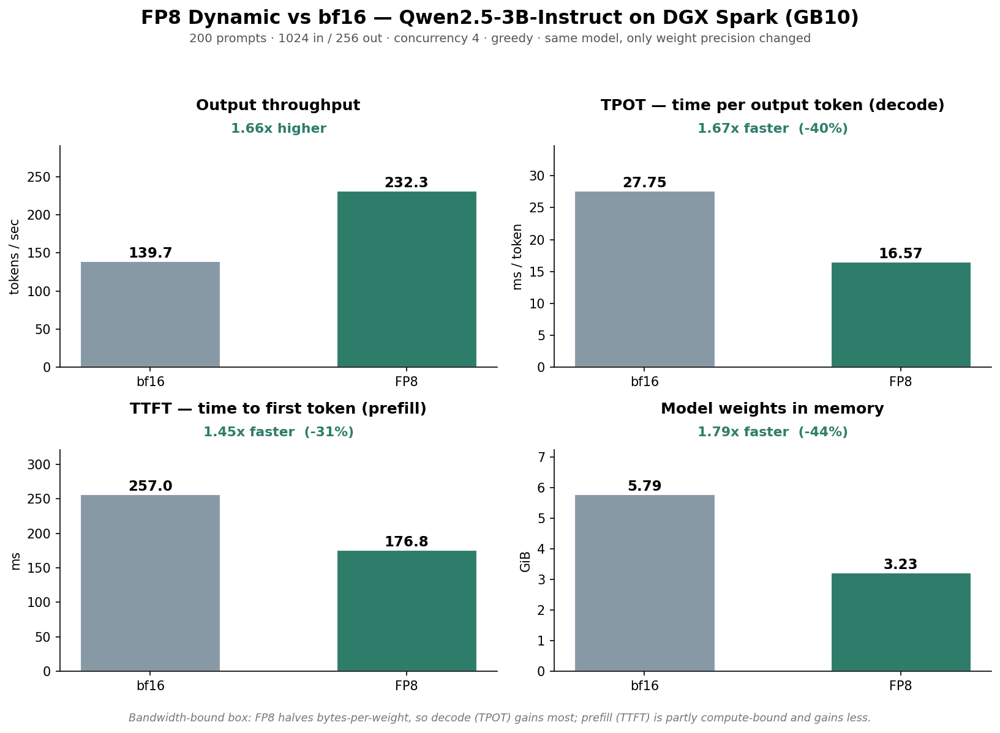

# Stage 1 + 3 — FP8 Dynamic Quantization

FP8 dynamic quantization of Qwen2.5-3B-Instruct on an NVIDIA DGX Spark (GB10, ~273 GB/s
unified memory bandwidth), measured before/after on the same box, same serving config,
same benchmark. Only weight precision changed — and that alone bought a **1.66x**
throughput jump and **1.67x** faster decode.



## Contents

- [The box](#the-box)
- [Walkthrough](#walkthrough)
  - [0. Environment](#0-environment)
  - [1. Serve the bf16 baseline](#1-serve-the-bf16-baseline)
  - [2. Benchmark the bf16 baseline](#2-benchmark-the-bf16-baseline)
  - [3. Quantize to FP8](#3-quantize-to-fp8)
  - [4. Serve and benchmark FP8](#4-serve-and-benchmark-fp8)
- [Results](#results)
- [Why the gain is a bandwidth story](#why-the-gain-is-a-bandwidth-story)
  - [Roofline: is this box actually bandwidth-bound?](#roofline-is-this-box-actually-bandwidth-bound)
  - [The KV cache math](#the-kv-cache-math)
  - [Capacity ceiling vs. bandwidth ceiling](#capacity-ceiling-vs-bandwidth-ceiling)
- [Gotchas](#gotchas)
- [Reproduce](#reproduce)
- [Reference](#reference)

## The box

NVIDIA DGX Spark: GB10 Grace-Blackwell, 128 GB unified LPDDR5x (shared CPU+GPU), ~273 GB/s
memory bandwidth, driver 580.159.03, CUDA 13.0. vLLM served via the `cu130-nightly`
container (`vllm/vllm-openai:cu130-nightly`) — the stable image doesn't support GB10's
`sm_121` at all.

## Walkthrough

Model: Qwen2.5-3B-Instruct · `vllm bench serve`, 200 prompts, 1024 in / 256 out,
concurrency 4, greedy (`temperature 0`), `--ignore-eos` for a fixed output length so
throughput math is on a known token count.

### 0. Environment

```bash
nvidia-smi
# Driver Version: 580.159.03, CUDA Version: 13.0, GPU idle, 0% util

docker pull vllm/vllm-openai:cu130-nightly
```

### 1. Serve the bf16 baseline

```bash
docker run -d --name vllm --ipc=host --gpus all -p 8000:8000 \
  -v ~/.cache/huggingface:/root/.cache/huggingface \
  vllm/vllm-openai:cu130-nightly \
  Qwen/Qwen2.5-3B-Instruct \
    --max-model-len 8192 \
    --gpu-memory-utilization 0.85 \
    --max-num-seqs 4
```

Reading the startup log (`docker logs -f vllm`) closely pays off — several lines here
drive the rest of the story:

- `enable_prefix_caching=True, enable_chunked_prefill=True` — **both on by default** in
  modern vLLM. Stages 02 and 03 aren't "adding" these optimizations; they're measuring
  and explaining defaults, then toggling them off to show the delta.
- `Not enough SMs to use max_autotune_gemm mode` — Inductor counted the GB10's Streaming
  Multiprocessors and decided its aggressive GEMM autotuning mode isn't worth it. Not an
  error — it's the compiler itself telling you this is a **compute-light** GPU. Direct
  evidence for the bandwidth-bound thesis below.
- `Model loading took 5.79 GiB memory` — the baseline weight footprint. FP8 roughly
  halves this. (3B params × 2 bytes/param ≈ 5.75 GB on disk — the arithmetic checks out.)
- `Available KV cache memory: 93.75 GiB` → `GPU KV cache size: 2,730,528 tokens` →
  `Maximum concurrency for 8,192 tokens per request: 333.32x`. This is the number the
  [capacity vs. bandwidth](#capacity-ceiling-vs-bandwidth-ceiling) section below is built on.
- Sampling params: Qwen ships its own generation defaults (`temperature=0.7`, etc.) that
  vLLM will use unless overridden — which is why the benchmark below pins `--temperature
  0.0` explicitly, identically across bf16 and FP8, so it's a like-for-like comparison.

Quick check that it's actually serving:
```bash
curl -N http://localhost:8000/v1/chat/completions \
  -H "Content-Type: application/json" \
  -d '{"model":"Qwen/Qwen2.5-3B-Instruct","messages":[{"role":"user","content":"Explain what a KV cache is in two sentences."}],"stream":true}'
```

### 2. Benchmark the bf16 baseline

```bash
docker exec -it vllm vllm bench serve \
  --model Qwen/Qwen2.5-3B-Instruct \
  --dataset-name random \
  --num-prompts 200 --num-warmups 3 \
  --random-input-len 1024 --random-output-len 256 \
  --max-concurrency 4 \
  --temperature 0.0 --ignore-eos \
  --metric-percentiles 50,95,99 \
  --save-result --save-detailed \
  --result-dir /root/results --result-filename baseline-bf16.json \
  --metadata precision=bf16 model=Qwen2.5-3B gpu=GB10
```

```
============ Serving Benchmark Result ============
Benchmark duration (s):                  366.59
Output token throughput (tok/s):         139.66
---------------Time to First Token----------------
Median TTFT (ms):                        257.05
P99 TTFT (ms):                           314.20
-----Time per Output Token (excl. 1st token)------
Median TPOT (ms):                        27.75
---------------Inter-token Latency----------------
Median ITL (ms):                         27.46
==================================================
```

**First look:** TPOT (27.75 ms) and ITL (27.46 ms) are nearly identical — that's the
signature of smooth, evenly-paced decode with no stalls or batching hiccups, exactly
what a healthy single-node serve at low concurrency should look like. TTFT's p50→p99
spread (257 → 314 ms) is tight, meaning no queueing buildup. And the roofline
prediction (below) said ~47 tok/s per stream; measured per-stream rate here is
139.66 / 4 ≈ 35 tok/s — lower than the weights-only prediction because real decode also
pays KV-cache reads, attention compute, and kernel-launch overhead that the simplified
roofline ignores.

### 3. Quantize to FP8

Separate venv so the quantization tooling doesn't pollute anything else:
```bash
python3 -m venv .venv-quant && source .venv-quant/bin/activate
pip install llmcompressor
```

`scripts/quantize-fp8.py`:
```python
from transformers import AutoModelForCausalLM, AutoTokenizer
from llmcompressor import oneshot
from llmcompressor.modifiers.quantization import QuantizationModifier

MODEL_ID = "Qwen/Qwen2.5-3B-Instruct"
model = AutoModelForCausalLM.from_pretrained(MODEL_ID, device_map="auto", dtype="auto")
tokenizer = AutoTokenizer.from_pretrained(MODEL_ID)

recipe = QuantizationModifier(targets="Linear", scheme="FP8_DYNAMIC", ignore=["lm_head"])
oneshot(model=model, recipe=recipe)

SAVE_DIR = "models/Qwen2.5-3B-Instruct-FP8-Dynamic"
model.save_pretrained(SAVE_DIR)
tokenizer.save_pretrained(SAVE_DIR)
```

```bash
python scripts/quantize-fp8.py
```

```
Loading weights: 100%|██████████| 434/434 [00:35<00:00, 12.33it/s]
IndependentPipeline | INFO - Inferred `DataFreePipeline` for `QuantizationModifier`
Compressing model: 100%|██████████| 252/252 [00:00<00:00, 983.55it/s]
Writing model shards: 100%|██████████| 1/1 [00:25<00:00, 25.08s/it]
Saved to models/Qwen2.5-3B-Instruct-FP8-Dynamic
```

Two things worth understanding here, not just running:

- **`DataFreePipeline`** — this is the log line that proves the "no calibration data
  needed" claim. `FP8_DYNAMIC` computes activation scales live at inference time, so
  `oneshot()` needs zero sample data up front. A static scheme (calibrated ahead of time)
  would instead pick a calibration pipeline and demand a dataset here.
- **252 modules compressed in well under a second** — that's the tell that this is pure
  post-training weight conversion (compute each channel's scale, cast bf16→FP8), not a
  calibration pass that would run hundreds of samples through the model and take minutes.
- **Weights vs. activations, and why both get quantized.** Weights are fixed, so their
  scales are computed **once, per channel** (one scale per output row of the matrix —
  finer than one scale for the whole tensor, so no channel's dynamic range gets crushed
  by a neighbor's). Activations are different every token, so their scale is computed
  **dynamically, per token, at inference time** — no calibration needed because it's
  measured from the real values as they pass through. Quantizing weights alone would
  shrink the file on disk but *not* speed up decode: a matmul needs both operands in a
  compatible format, and if activations stayed bf16 the hardware would have to upconvert
  the FP8 weights back to bf16 and fall back to a slow mixed-precision path. Quantizing
  activations too is what lets the fast native FP8×FP8 matmul kernel actually run.

Result on disk: `model.safetensors` at 3.2 GB (down from 5.75 GB bf16), plus config,
tokenizer, and a small `recipe.yaml` recording exactly what was quantized.

### 4. Serve and benchmark FP8

Stop the bf16 container, then serve the quantized model — **everything else held
identical** (port, `max-model-len`, `gpu-memory-utilization`, `max-num-seqs`) so only
precision changes:

```bash
docker stop vllm && docker rm vllm

docker run -d --name vllm-fp8 --ipc=host --gpus all -p 8000:8000 \
  -v ~/.cache/huggingface:/root/.cache/huggingface \
  -v ~/code/inference-benchmark-lab/models:/models \
  vllm/vllm-openai:cu130-nightly \
  /models/Qwen2.5-3B-Instruct-FP8-Dynamic \
    --served-model-name Qwen2.5-3B-FP8 \
    --max-model-len 8192 \
    --gpu-memory-utilization 0.85 \
    --max-num-seqs 4
```

Startup log highlights:
```
Selected CutlassFP8ScaledMMLinearKernel for CompressedTensorsW8A8Fp8
Checkpoint size: 3.17 GiB (was 5.75 GiB)
Model loading took 3.23 GiB memory and 11.56 seconds (was 5.79 GiB / 173.95 s — the
  earlier number included a one-time cold HF download, not a fair comparison)
Available KV cache memory: 96.84 GiB (was 93.75 GiB)
GPU KV cache size: 2,820,688 tokens — Maximum concurrency for 8,192 tokens: 344.32x (was 333.32x)
```

`CutlassFP8ScaledMMLinearKernel` confirms the fast path: an 8-bit-weight, 8-bit-activation
CUTLASS kernel that applies the per-channel/per-token scales inside the matmul itself —
not a fallback that upconverts to bf16. And the freed weight memory (5.75 → 3.17 GB ≈
2.58 GB) plus a small reduction in CUDA-graph pool memory shows up almost exactly as more
KV cache room (93.75 → 96.84 GiB, +3.09 GB ≈ +90,000 tokens at 36 KB/token) — the KV
cache itself stayed bf16 (`kv_cache_dtype=auto`), so this gain is purely "smaller weights,
more room left over," not a KV-cache optimization.

**Quality gut-check** before trusting any speed number:
```bash
curl -sS http://localhost:8000/v1/chat/completions \
  -H "Content-Type: application/json" \
  -d '{"model":"Qwen2.5-3B-FP8","messages":[{"role":"user","content":"Explain what a KV cache is in two sentences."}]}' \
  | jq -r '.choices[0].message.content'
# "A KV (Key-Value) cache is a type of database that stores data as key-value pairs..."
# — near-identical in substance to the bf16 answer. A one-prompt smoke test, not a
# rigorous quality eval (no perplexity/benchmark delta measured) — but no obvious
# regression on this prompt.
```

Benchmark (identical command to Step 2, only the model/tokenizer/output file differ):
```bash
docker exec -it vllm-fp8 vllm bench serve \
  --model Qwen2.5-3B-FP8 \
  --tokenizer /models/Qwen2.5-3B-Instruct-FP8-Dynamic \
  --dataset-name random \
  --num-prompts 200 --num-warmups 3 \
  --random-input-len 1024 --random-output-len 256 \
  --max-concurrency 4 \
  --temperature 0.0 --ignore-eos \
  --metric-percentiles 50,95,99 \
  --save-result --save-detailed \
  --result-dir /root/results --result-filename fp8-dynamic.json \
  --metadata precision=fp8-dynamic model=Qwen2.5-3B gpu=GB10
```

```
============ Serving Benchmark Result ============
Benchmark duration (s):                  220.42
Output token throughput (tok/s):         232.28
---------------Time to First Token----------------
Median TTFT (ms):                        176.78
-----Time per Output Token (excl. 1st token)------
Median TPOT (ms):                        16.57
==================================================
```

## Results

| Metric | What's better | bf16 | FP8-Dynamic | Change | What this means |
|---|---|---|---|---|---|
| Output throughput | higher | 139.7 tok/s | 232.3 tok/s | **1.66x** | Total tokens/sec across the same 4 concurrent requests — noticeably faster in aggregate |
| Median TPOT | lower | 27.75 ms | 16.57 ms | **1.67x faster** | How long each word takes to appear once the reply is streaming — a big, noticeable speedup |
| Median TTFT | lower | 257.0 ms | 176.8 ms | **1.45x faster** | How long you wait before the first word — snappier, but less than the decode gain |
| Benchmark duration | lower | 366.6 s | 220.4 s | **1.66x faster** | Wall-clock time for the whole 200-request test — cut by about a third |
| Model size (on disk) | lower | 5.75 GB | 3.17 GB | 45% smaller | The file `vllm serve` loads |
| Weights (in memory) | lower | 5.79 GB | 3.23 GB | 44% smaller | What the boot log reports actually landed on the GPU |
| Quality (spot-check) | — | coherent | coherent | no obvious regression | Same question, same-substance answer, eyeballed side by side — a smoke test, not a rigorous eval |

Throughput and TPOT moving together (1.66x / 1.67x) is the tell that this is a genuine
decode speedup, not a benchmarking artifact — they're two views of the same effect.

## Why the gain is a bandwidth story

The Spark is memory-bandwidth-bound, not compute-bound. During decode, generating one
token requires streaming the entire weight set across the ~273 GB/s memory bus, while
the actual arithmetic per token is small — the `Not enough SMs to use max_autotune_gemm
mode` compiler note above is independent evidence of this. So decode time is dominated by
bytes moved, not FLOPs.

FP8 halves the bytes per weight (2 bytes → 1), so on a bandwidth-bound box the decode
speedup tracks the byte reduction. The result (1.67x) lands just short of the theoretical
2x because:

- The KV cache stayed bf16 (`kv_cache_dtype=auto`), so KV-read bytes per token did not shrink.
- Fixed per-step overhead (kernel launches, scheduling, sampling) does not scale with precision.

TPOT (decode) improved 1.67x but TTFT (prefill) only 1.45x. Prefill processes all 1024
input tokens at once and is more compute-bound, so a bandwidth optimization helps it less
— the gap between the two speedups is the signature of decode being bandwidth-bound and
prefill being partly compute-bound.

### Roofline: is this box actually bandwidth-bound?

The theoretical floor for one decode step is model size ÷ bandwidth:
5.75 GB ÷ 273 GB/s ≈ 21 ms/token. Measured bf16 TPOT is 27.75 ms — only **1.31x** that
floor, meaning almost the entire budget really is spent streaming weight bytes across
the bus. That gap (21 → 27.75 ms) is KV-cache reads, attention compute, and
kernel-launch overhead that the simplified weights-only roofline doesn't account for.

Per-stream decode rate from the same math: 273 GB/s ÷ 5.75 GB ≈ 47 tokens/sec/stream
(upper bound, weights-only). Measured: 139.66 tok/s aggregate ÷ 4 concurrent streams ≈
35 tok/s/stream — again lower than the idealized floor for the same reason.

### The KV cache math

```
bytes_per_token = 2 (K and V) × num_layers × num_kv_heads × head_dim × dtype_bytes
                = 2 × 36 × 2 × 128 × 2
                = 36,864 bytes = 36 KB
```
(from Qwen2.5-3B-Instruct's real HF config: 36 layers, 2 KV heads, head_dim 128, bf16 KV)

The 2 KV heads vs. 16 attention heads is grouped-query attention (GQA) — an 8x reduction
in KV cache size already, before any quantization of the cache itself. (Query heads don't
appear in this formula at all — only K/V get cached, so cutting KV heads is cheap to keep
around and directly shrinks storage.)

Cross-checked against the live vLLM log: `Available KV cache memory: 93.75 GiB` →
93.75 GiB ÷ 36 KB/token = 2,730,667 tokens predicted, vLLM reported `2,730,528 tokens` —
agreement to within 139 tokens (**0.005%**). Same check on the FP8 run's freed-up memory:
the extra 3.09 GB (93.75 → 96.84 GiB, freed by smaller weights) predicts +90,003 tokens
(3.09 GB ÷ 36 KB); vLLM's actual reported KV cache size went from 2,730,528 → 2,820,688
tokens, an observed increase of 90,160 — agreement to within 157 tokens (**0.17%**).

### Capacity ceiling vs. bandwidth ceiling

The boot log reports **333 concurrent max-length (8192-token) sequences** of KV-cache
*storage* headroom — but the server is deliberately run at `--max-num-seqs 4`. That gap
(333 vs. 4) is the whole story in one number, and it's worth understanding precisely,
because it's two different ceilings governed by the same 273 GB/s pipe:

- **Capacity ceiling (KV cache storage):** how many sequences' worth of Key/Value tensors
  fit in the memory left over after weights — 333 here, governed by memory size and GQA.
  You only hit this if you try to *admit* more requests than it can hold.
- **Bandwidth ceiling (decode rate):** every decode step reads the *entire* weight set once
  — but that read is **shared** across every sequence in the batch, not repeated per
  sequence. A batch of 1 does one ~21ms step for 1 token (≈47 tok/s to that one user); a
  batch of 4 does one ~21ms step for 4 tokens (≈188 tok/s aggregate, each user still sees
  ≈47 tok/s). That's why batching is nearly free up to a point — the expensive part
  (streaming 5.75 GB across the bus) is paid once and split among everyone.

What eventually degrades per-user speed as you pack more sequences in isn't the weight
read (constant) — it's the **KV-cache read**, which is *not* shared and grows with batch
size. Past a certain batch size that per-step KV tax becomes a real fraction of the step
time, so the step rate drops below the weights-only ~47/sec and every user's stream slows
down. On this low-bandwidth box, that degradation starts mattering past roughly 4
concurrent streams — which is exactly why the recipe pins `--max-num-seqs 4` here, far
below the 333-sequence storage ceiling. (On a GPU with 12x the bandwidth, that sweet spot
would sit much higher.)

So: 333 is storage capacity (memory size + GQA), the concurrency actually run is a
latency/throughput choice (~4, governed by bandwidth), and ~47 tok/s/stream is decode
speed (also governed by bandwidth). Same root cause — the 273 GB/s pipe — showing up as
two independent limits.

## Gotchas

- **`--ignore-eos` is load-bearing for the comparison.** Without it, requests stop early
  at random lengths and the "256 output tokens" assumption (and therefore the throughput
  math) breaks. With `--random-range-ratio 0.0` (the default), every prompt is *exactly*
  1024 in / 256 out — zero shape variance between the bf16 and FP8 runs, which is the
  right call for a clean before/after even though it's less realistic than production
  traffic.
- **Qwen's own generation defaults will silently override yours.** The model ships
  `generation_config.json` with `temperature=0.7, top_k=20, top_p=0.8`; vLLM honors it
  unless you pass explicit sampling params. Both benchmarks here pin `--temperature 0.0`
  so bf16 and FP8 are actually comparable.
- **"Peak concurrent requests: 8" despite `--max-concurrency 4`.** This is client-side
  in-flight accounting overlap in the benchmark tool, not a server-side violation of the
  concurrency cap — don't read it as the server admitting 8 requests at once.
- **The FP8 boot log's `dtype=torch.bfloat16` is not a bug.** That field is the
  *activation/compute* dtype, which stays bf16; `quantization=compressed-tensors` (vs.
  `None` on the bf16 run) is the field that confirms weights are actually quantized.
- **First bf16 boot includes a one-time HF download** (~130s, cached afterward) baked
  into its "model loading took N seconds" log line — don't compare that number directly
  against the FP8 boot's load time; compare disk/memory footprint instead.

## Reproduce

Serve and benchmark the bf16 baseline:
```
./scripts/serve.sh
./scripts/bench-baseline.sh
```

Quantize to FP8, then serve and benchmark:
```
python scripts/quantize-fp8.py        # in a venv with: pip install llmcompressor
./scripts/serve-fp8.sh
./scripts/bench-fp8.sh
```

Regenerate the chart:
```
python scripts/make-chart.py
```

## Reference

- Raw results: `results/baseline-bf16.json`, `results/fp8-dynamic.json` (exact commands
  and metadata embedded in each file).
- Chart script: `scripts/make-chart.py` → `charts/fp8-vs-bf16.png`.
- Quantization script: `scripts/quantize-fp8.py`.
