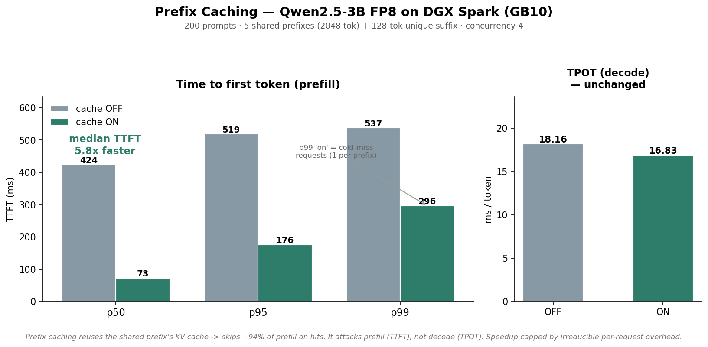

# Stage 3 (cont.) — Prefix Caching

Different mechanism, different phase from FP8: prefix caching reuses the KV cache
computed for a shared prompt prefix across requests, so a cache hit only has to
prefill the unique suffix — not the whole prompt. Measured on the same box, same
FP8-quantized model as [01-fp8-quantization](../01-fp8-quantization/): **5.8x**
faster median TTFT, TPOT essentially unchanged.



## Contents

- [The workload](#the-workload)
- [Walkthrough](#walkthrough)
  - [1. Run with caching ON](#1-run-with-caching-on)
  - [2. Run with caching OFF](#2-run-with-caching-off)
- [Results](#results)
- [Why: skip redundant prefill, not a decode trick](#why-skip-redundant-prefill-not-a-decode-trick)
- [Why 5.8x and not ~17x](#why-58x-and-not-17x)
- [Gotchas](#gotchas)
- [Reproduce](#reproduce)
- [Reference](#reference)

## The workload

Prefix caching is a *server* flag (`--no-enable-prefix-caching`), not a benchmark flag —
so measuring "off" means standing up a second server, not passing a different client
argument.

The `prefix_repetition` dataset generates prompts that share a common prefix, with three
relevant knobs: `--prefix-repetition-prefix-len` (shared tokens), `--prefix-repetition-
suffix-len` (unique tokens per request), `--prefix-repetition-num-prefixes` (how many
distinct prefixes; prompts-per-prefix = `num_prompts / num_prefixes`). To make cache
reuse heavy, this run uses a **long shared prefix and few distinct prefixes**:

- 200 prompts, 5 distinct prefixes → 40 prompts share each prefix (39 of 40 are cache hits).
- 2048-token shared prefix + 128-token unique suffix (2176 tokens total input) → 94% of
  each prompt's input is shared.
- Concurrency 4, greedy, `--ignore-eos`, same FP8-quantized Qwen2.5-3B as Stage 1.

## Walkthrough

### 1. Run with caching ON

Prefix caching is on by default in vLLM, so this reuses the FP8 server already running
from [01-fp8-quantization](../01-fp8-quantization/) — no re-serve needed:

```bash
docker exec -it vllm-fp8 vllm bench serve \
  --model Qwen2.5-3B-FP8 \
  --tokenizer /models/Qwen2.5-3B-Instruct-FP8-Dynamic \
  --dataset-name prefix_repetition \
  --num-prompts 200 --num-warmups 3 \
  --prefix-repetition-prefix-len 2048 \
  --prefix-repetition-suffix-len 128 \
  --prefix-repetition-num-prefixes 5 \
  --prefix-repetition-output-len 128 \
  --max-concurrency 4 --temperature 0.0 --ignore-eos \
  --metric-percentiles 50,95,99 \
  --save-result --save-detailed \
  --result-dir /root/results --result-filename prefix-cache-on.json \
  --metadata prefix_caching=on precision=fp8-dynamic
```

```
============ Serving Benchmark Result ============
Benchmark duration (s):                  110.84
Output token throughput (tok/s):         230.96
---------------Time to First Token----------------
Median TTFT (ms):                        73.14
P95 TTFT (ms):                           176.20
P99 TTFT (ms):                           296.37
-----Time per Output Token (excl. 1st token)------
Median TPOT (ms):                        16.83
==================================================
```

Copy the result out and stop the container before starting the OFF case:
```bash
docker cp vllm-fp8:/root/results/prefix-cache-on.json results/
docker stop vllm-fp8
```

### 2. Run with caching OFF

Start a **second** server, same quantized model, with caching explicitly disabled, on a
different host port (8001) so it doesn't collide with `vllm-fp8`:

```bash
docker run -d --name vllm-fp8-nocache --ipc=host --gpus all -p 8001:8000 \
  -v ~/.cache/huggingface:/root/.cache/huggingface \
  -v ~/code/inference-benchmark-lab/models:/models \
  vllm/vllm-openai:cu130-nightly \
  /models/Qwen2.5-3B-Instruct-FP8-Dynamic \
    --served-model-name Qwen2.5-3B-FP8 \
    --max-model-len 8192 \
    --gpu-memory-utilization 0.85 \
    --max-num-seqs 4 \
    --no-enable-prefix-caching
```

Verify the flag actually landed before benchmarking:
```
non-default args: {..., 'enable_prefix_caching': False, 'max_num_seqs': 4}
```

```bash
docker exec -it vllm-fp8-nocache vllm bench serve \
  --model Qwen2.5-3B-FP8 \
  --tokenizer /models/Qwen2.5-3B-Instruct-FP8-Dynamic \
  --dataset-name prefix_repetition \
  --num-prompts 200 --num-warmups 3 \
  --prefix-repetition-prefix-len 2048 \
  --prefix-repetition-suffix-len 128 \
  --prefix-repetition-num-prefixes 5 \
  --prefix-repetition-output-len 128 \
  --max-concurrency 4 --temperature 0.0 --ignore-eos \
  --metric-percentiles 50,95,99 \
  --save-result --save-detailed \
  --result-dir /root/results --result-filename prefix-cache-off.json \
  --metadata prefix_caching=off precision=fp8-dynamic
```

```
============ Serving Benchmark Result ============
Benchmark duration (s):                  136.12
Output token throughput (tok/s):         188.08
---------------Time to First Token----------------
Median TTFT (ms):                        423.93
P95 TTFT (ms):                           518.93
P99 TTFT (ms):                           537.46
-----Time per Output Token (excl. 1st token)------
Median TPOT (ms):                        18.16
==================================================
```

Cleanup — remove the temporary no-cache server and bring the FP8 server back up for
later stages:
```bash
docker rm -f vllm-fp8-nocache
docker start vllm-fp8
```

## Results

| Metric | What's better | Cache OFF | Cache ON | Change | What this means |
|---|---|---|---|---|---|
| Median TTFT | lower | 423.93 ms | 73.14 ms | **5.8x faster** | How long before the first word appears — dramatically snappier |
| P95 TTFT | lower | 518.93 ms | 176.20 ms | ~2.9x faster | Even the slower tail improves a lot |
| P99 TTFT | lower | 537.46 ms | 296.37 ms | ~1.8x faster | The worst case improves less — these are the cold-miss requests (below) |
| Median TPOT | lower | 18.16 ms | 16.83 ms | ~unchanged (1.07x) | Decode speed barely moves — caching doesn't touch decode |
| Output throughput | higher | 188.08 tok/s | 230.96 tok/s | 1.23x | A side benefit: cheaper prefill frees more time for decode |
| Benchmark duration | lower | 136.12 s | 110.84 s | 1.23x faster | Matches the throughput gain |

## Why: skip redundant prefill, not a decode trick

A cache hit skips re-prefilling the shared 2048-token prefix — 94% of the prompt (2048 of
2176 input tokens) — and only prefills the unique 128-token suffix. That's why this
attacks TTFT specifically and leaves TPOT essentially flat: it removes prefill *work*, it
doesn't make decode any cheaper. FP8 is the mirror image — it makes every decode step
cheaper but does little for prefill:

| | TTFT | TPOT |
|---|---|---|
| **FP8 quantization** | reduces a bit (1.45x) | reduces a lot (1.67x) |
| **Prefix caching** | reduces a lot (5.8x) | reduces a bit (~unchanged) |

Different phase, different mechanism — exactly why the two optimizations stack rather
than compete for the same budget.

The p99 tail stays high even with caching on (296 ms vs. 73 ms median) — those are the
**cold-miss requests**: the first request against each of the 5 prefixes still pays the
full prefill once, since nothing is cached yet for a prefix that's never been seen. With
5 prefixes and 200 requests, that's exactly 5 of 200 requests paying full price — right
around the p97.5 mark, consistent with the p99 tail being dominated by cache misses.

## Why 5.8x and not ~17x

94% of the prompt is cached, so a naive guess is a much bigger speedup: cache hits only
do 6% of the original prefill work, so 100/6 ≈ **17x**. Measured speedup is 5.8x. Why the
gap?

TTFT isn't purely prefill compute — it includes things that don't shrink when the prefix
is cached: the 128-token suffix still has to be prefilled every time regardless of
caching; queueing for a concurrency-4 slot; sampling, detokenizing, and request-handling
overhead; and the cache lookup itself isn't literally free. So:

```
TTFT = (prefill of the uncached part) + (fixed overhead that caching can't touch)
```

Solve for the per-token prefill rate from the measured difference:
```
Cache OFF fills all 2176 tokens: TTFT = 423.93 ms
Cache ON fills only the 128 suffix tokens: TTFT = 73.14 ms
Difference = 423.93 - 73.14 = 350.79 ms  →  cost of the 2048 tokens caching removed
350.79 ms / 2048 tokens ≈ 0.171 ms/token
```

Use that rate to predict the suffix-fill cost, then back out the fixed overhead:
```
Predicted suffix-fill time = 128 × 0.171 ≈ 21.92 ms
Cache ON TTFT (73.14 ms) - suffix-fill (21.92 ms) = 51.22 ms  →  fixed per-request overhead
```

Now reconstruct both measured numbers from these three independent pieces (shared-prefix
fill + suffix fill + fixed overhead) as a cross-check:

```
Cache OFF: 2048 × 0.171 + 128 × 0.171 + 51.22 = 350.2 + 21.98 + 51.22 = 423.4 ms   (measured: 423.93 ms)
Cache ON:           0    + 128 × 0.171 + 51.22 =    0   + 21.98 + 51.22 =  73.2 ms   (measured: 73.14 ms)
```

Both reconstructions land within noise of the measured medians. The suffix-fill and
fixed-overhead terms are cache-invariant by construction, so the 5.8x speedup is really
just *(measured TTFT) / (the fixed cost caching can never remove)* — not the naive
1/(1 − 0.94) ≈ 17x you'd get from "94% of tokens are free," because the 6% that's never
free (suffix + overhead) dominates once the 94% drops out.

## Gotchas

- **Caching is a server flag, not a client flag.** You cannot A/B this with one running
  server and two benchmark invocations — the OFF case genuinely needs a second container.
- **Port collision is the easy mistake.** The second server must publish a different host
  port (8001 here) since the first server is still bound to 8000; both map to the
  container's internal port 8000 either way.
- **Restart order matters for later stages.** After the OFF run, the no-cache container is
  removed and the original `vllm-fp8` container is restarted (not recreated) so later
  work picks back up on the same server.
- **The p99 tail is not noise — it's a fixed, countable population** (one cold-miss per
  distinct prefix). Don't try to explain it away by asking for more warmup; it will
  persist at any warmup count because it's structural to the workload (5 prefixes = 5
  unavoidable full-prefill requests), not a measurement artifact.

## Reproduce

Caching ON reuses the FP8 server from `01-fp8-quantization` (prefix caching is on by
default in vLLM), so start that first:
```
cd ../01-fp8-quantization && ./scripts/serve-fp8.sh && cd -
./scripts/bench-prefix.sh on
```

Caching OFF needs a second server (same model, `--no-enable-prefix-caching`, on host
port 8001 so it doesn't collide with the one above):
```
./scripts/serve-prefix-off.sh
./scripts/bench-prefix.sh off
```

Regenerate the chart:
```
python scripts/make-chart-prefix.py
```

## Reference

- Raw results: `results/prefix-cache-on.json`, `results/prefix-cache-off.json`.
- Chart script: `scripts/make-chart-prefix.py` → `charts/prefix-caching-ttft.png`.
- Serve/bench scripts: `scripts/serve-prefix-off.sh`, `scripts/bench-prefix.sh {on|off}`.
