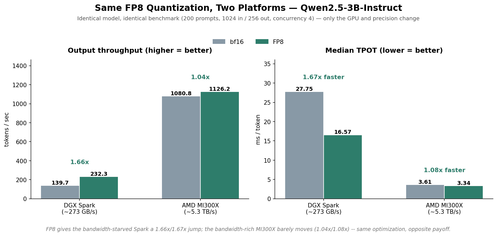
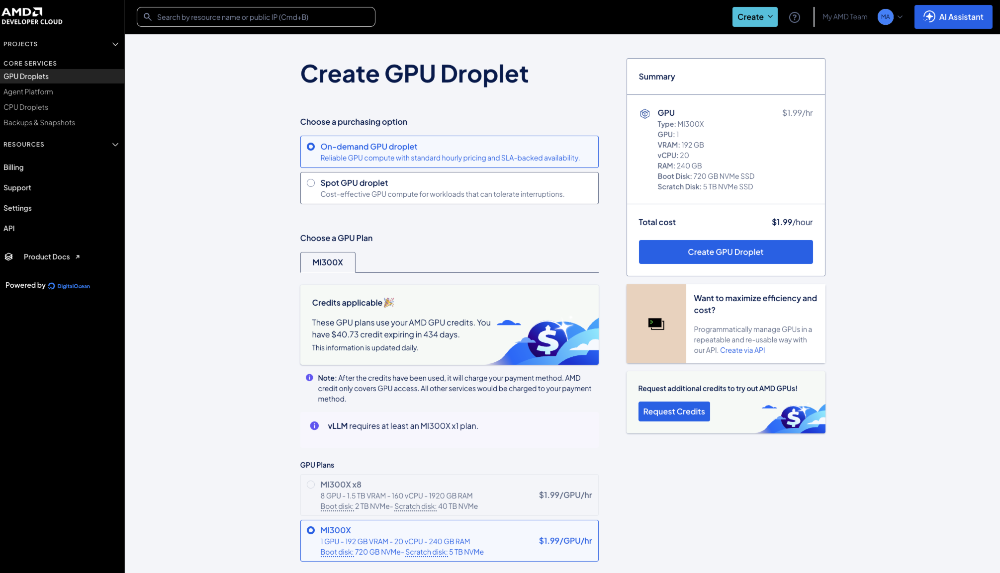
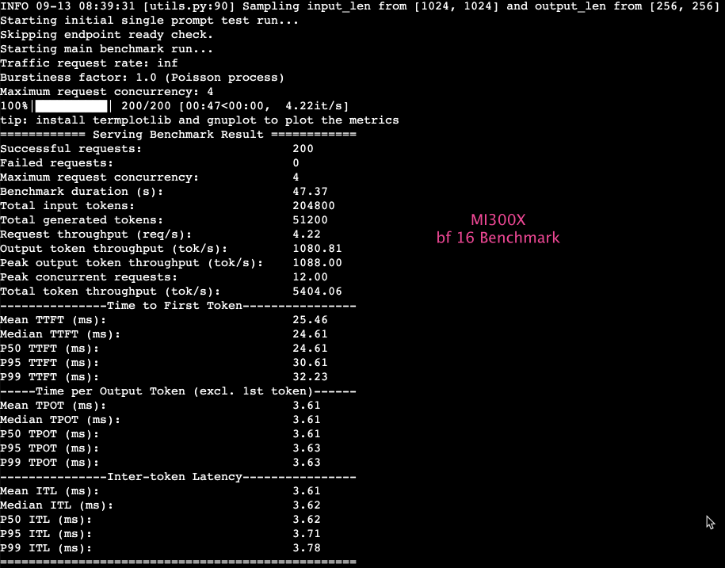
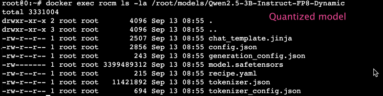
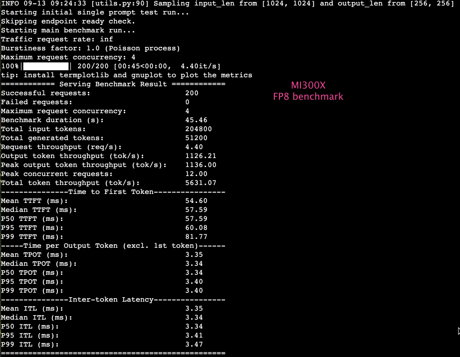
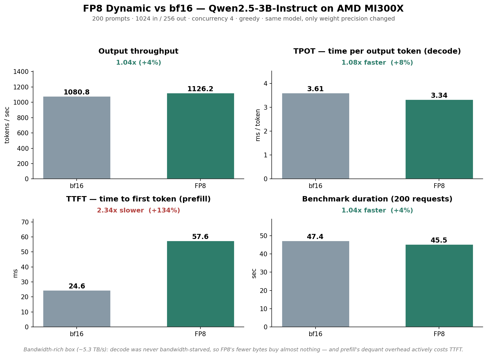

# Cross-Platform FP8: NVIDIA DGX Spark vs AMD MI300X

The same FP8 quantization that gives a **1.66× speedup** on an NVIDIA DGX Spark
gives only **~1.04×** on an AMD MI300X. Same model, same quantization scheme, same
benchmark — the optimization's value depends almost entirely on how
memory-bandwidth-bound the hardware is.



## Contents

- [The two platforms](#the-two-platforms)
- [Walkthrough (MI300X, AMD Developer Cloud)](#walkthrough-mi300x-amd-developer-cloud)
  - [0. Provision the GPU droplet](#0-provision-the-gpu-droplet)
  - [1. Check the environment](#1-check-the-environment)
  - [2. Serve and benchmark the bf16 baseline](#2-serve-and-benchmark-the-bf16-baseline)
  - [3. Quantize to FP8](#3-quantize-to-fp8)
  - [4. Serve and benchmark FP8](#4-serve-and-benchmark-fp8)
- [Results](#results)
  - [AMD MI300X (this experiment)](#amd-mi300x-this-experiment)
  - [NVIDIA DGX Spark (from earlier work, for comparison)](#nvidia-dgx-spark-from-earlier-work-for-comparison)
  - [The headline comparison (within-device: does FP8 help this GPU?)](#the-headline-comparison-within-device-does-fp8-help-this-gpu)
  - [Across-device: how much faster is MI300X, period](#across-device-how-much-faster-is-mi300x-period)
- [Why: FP8's value is proportional to how bandwidth-bound you are](#why-fp8s-value-is-proportional-to-how-bandwidth-bound-you-are)
  - [The TTFT wrinkle](#the-ttft-wrinkle)
- [Takeaway](#takeaway)
- [Reference](#reference)

## The two platforms

| Spec | DGX Spark (GB10) | AMD MI300X |
|---|---|---|
| Memory | 128 GB unified LPDDR5x (shared CPU+GPU) | 192 GB HBM3 |
| Memory bandwidth | ~273 GB/s | ~5.3 TB/s (~19× Spark) |
| Peak compute, FP8 | not officially published | ~2,209 TFLOPS |
| Peak compute, BF16/FP16 | not officially published (FP32: 31 TFLOPS) | ~1,307 TFLOPS |
| TDP | 140 W | 750 W |

Sources: [NVIDIA DGX Spark product page](https://www.nvidia.com/en-us/products/workstations/dgx-spark/),
[AMD Instinct MI300X product page](https://www.amd.com/en/products/accelerators/instinct/mi300/mi300x.html).
NVIDIA hasn't published a discrete FP8/BF16 TFLOPS figure for GB10 specifically (only the ~1 petaFLOP FP4
headline number and 31 TFLOPS FP32).

The ~19× bandwidth gap (not the TFLOPS gap) is the single number that explains everything in this doc: it's
why decode is bandwidth-bound on one platform and not the other, which is the entire reason FP8 pays off so
differently on each.

## Walkthrough (MI300X, AMD Developer Cloud)

Model: Qwen2.5-3B-Instruct · `vllm bench serve`, 200 prompts, 1024 in / 256 out, concurrency 4, greedy,
`--ignore-eos` for fixed output length. Environment: AMD Developer Cloud instance, vLLM served from inside
a container named `rocm` (`docker exec ... rocm ...` throughout), vLLM `0.27.1+rocm723`.

### 0. Provision the GPU droplet



AMD Developer Cloud (powered by DigitalOcean), on-demand GPU droplet: 1× MI300X, 192 GB VRAM, 20 vCPU,
240 GB RAM, 720 GB NVMe boot disk + 5 TB NVMe scratch disk, $1.99/GPU/hr.

### 1. Check the environment

```bash
docker exec rocm vllm --version
# 0.27.1+rocm723

docker exec rocm amd-smi monitor
# GPU idle, 0% util, 0.3/191.7 GB VRAM used, confirming a clean start
```

### 2. Serve and benchmark the bf16 baseline

```bash
# serve, detached
docker exec -d rocm vllm serve Qwen/Qwen2.5-3B-Instruct \
  --port 8000 --max-model-len 8192 --gpu-memory-utilization 0.85

# quick health check
docker exec rocm curl -s http://localhost:8000/v1/chat/completions \
  -H 'Content-Type: application/json' \
  -d '{"model":"Qwen/Qwen2.5-3B-Instruct","messages":[{"role":"user","content":"Say hello in one word."}]}'
# {"...", "content":"Hi.", ...} — confirmed serving real completions before benchmarking

# benchmark
docker exec rocm vllm bench serve \
  --model Qwen/Qwen2.5-3B-Instruct \
  --dataset-name random --num-prompts 200 --max-concurrency 4 \
  --random-input-len 1024 --random-output-len 256 \
  --temperature 0.0 --ignore-eos --metric-percentiles 50,95,99 \
  --save-result --result-dir /root/results --result-filename mi300x-bf16.json \
  --metadata platform=MI300X precision=bf16
```



**First look:** 1080.8 tok/s, median TPOT 3.61 ms, median TTFT 24.6 ms. Already strikingly fast next to the
Spark's bf16 numbers (139.7 tok/s, 27.75 ms) — first hint that this GPU isn't going to be bandwidth-starved
the way the Spark is.

Copied the result off the droplet before moving on:
```bash
docker cp rocm:/root/results ./results
scp -r root@<droplet-ip>:~/results /path/to/cross-platform-mi300x/
```

### 3. Quantize to FP8

```bash
docker exec rocm pip install llmcompressor
```

`quantize.py`, copied into the container and run there:

```python
from transformers import AutoModelForCausalLM, AutoTokenizer
from llmcompressor import oneshot
from llmcompressor.modifiers.quantization import QuantizationModifier

MODEL_ID = "Qwen/Qwen2.5-3B-Instruct"
model = AutoModelForCausalLM.from_pretrained(MODEL_ID, device_map="auto", dtype="auto")
tokenizer = AutoTokenizer.from_pretrained(MODEL_ID)

recipe = QuantizationModifier(targets="Linear", scheme="FP8_DYNAMIC", ignore=["lm_head"])
oneshot(model=model, recipe=recipe)

SAVE_DIR = "models/Qwen2.5-3B-Instruct-FP8-Dynamic"
model.save_pretrained(SAVE_DIR)
tokenizer.save_pretrained(SAVE_DIR)
```

```bash
docker cp quantize.py rocm:/root/quantize.py
docker exec -w /root rocm python quantize.py
```



Confirms the quantized weights actually landed on disk (`model.safetensors`, ~3.3 GB) alongside the
tokenizer/config/chat-template files `vllm serve` needs to load it as a normal local model.

### 4. Serve and benchmark FP8

The bf16 server has to come down first — same port, one GPU:

```bash
docker exec rocm pkill -f "vllm serve"

# serve the quantized model, detached
docker exec -d rocm vllm serve /root/models/Qwen2.5-3B-Instruct-FP8-Dynamic \
  --served-model-name Qwen2.5-3B-FP8 \
  --port 8000 --max-model-len 8192 --gpu-memory-utilization 0.85

# confirm it's actually serving the quantized model under the new name
docker exec rocm curl -s http://localhost:8000/v1/models
# {"data":[{"id":"Qwen2.5-3B-FP8", ...}]}

# benchmark
docker exec rocm vllm bench serve \
  --model Qwen2.5-3B-FP8 \
  --tokenizer /root/models/Qwen2.5-3B-Instruct-FP8-Dynamic \
  --dataset-name random --num-prompts 200 --max-concurrency 4 \
  --random-input-len 1024 --random-output-len 256 \
  --temperature 0.0 --ignore-eos --metric-percentiles 50,95,99 \
  --save-result --result-dir /root/results --result-filename mi300x-fp8.json \
  --metadata platform=MI300X precision=fp8-dynamic
```



**First look:** 1126.2 tok/s (+4%), TPOT 3.34 ms (~7% faster) — barely moved despite halving the weight
bytes. TTFT actually got *worse* (24.6 → 57.6 ms). Confirms the hint from step 2: something about this
platform makes FP8 far less valuable than it was on the Spark. The rest of this doc is working out why.

## Results

### AMD MI300X (this experiment)

| Metric | What's better | bf16 | FP8-Dynamic | Change | What this means |
|---|---|---|---|---|---|
| Output throughput | higher | 1080.8 tok/s | 1126.2 tok/s | **1.04× (+4%)** | Total tokens generated per second across the same 4 concurrent requests — barely faster in aggregate |
| Median TPOT | lower | 3.61 ms | 3.34 ms | **1.08× faster (+8%)** | How long each word takes to appear once the reply has started streaming — a small improvement, hardly noticeable |
| Median TTFT | lower | 24.6 ms | 57.6 ms | **2.34× slower (+134%)** | How long you wait before the first word shows up — this actually got worse, so replies feel slightly slower to start |
| Benchmark duration | lower | 47.4 s | 45.5 s | **1.04× faster (+4%)** | How long the whole 200-request test took to finish — a bit quicker, matching the small throughput gain |



### NVIDIA DGX Spark (from earlier work, for comparison)

| Metric | What's better | bf16 | FP8-Dynamic | Change | What this means |
|---|---|---|---|---|---|
| Output throughput | higher | 139.7 tok/s | 232.3 tok/s | **1.66× (+66%)** | Total tokens generated per second across the same 4 concurrent requests — noticeably faster in aggregate |
| Median TPOT | lower | 27.75 ms | 16.57 ms | **1.67× faster** | How long each word takes to appear once the reply has started streaming — a big, noticeable speedup |
| Median TTFT | lower | 257 ms | 177 ms | **1.45× faster (+31%)** | How long you wait before the first word shows up — noticeably snappier at the start too |
| Benchmark duration | lower | 366.6 s | 220.4 s | **1.66× faster (+40%)** | How long the whole 200-request test took to finish — cut by about a third, matching the throughput gain |

### The headline comparison (within-device: does FP8 help this GPU?)

The same FP8-vs-bf16 change, side by side across both platforms — each cell is how much that metric
moved when switching to FP8, on that GPU.

| | Output throughput | Median TPOT | Median TTFT | Benchmark duration |
|---|---|---|---|---|
| **DGX Spark** (GB10, ~273 GB/s, bf16 TPOT 27.75 ms) | **1.66×** | **1.67× faster** | **1.45× faster** | **1.66× faster** |
| **AMD MI300X** (~5.3 TB/s, bf16 TPOT 3.61 ms) | **1.04×** | **1.08× faster** | **2.34× slower** | **1.04× faster** |

### Across-device: how much faster is MI300X, period

A different comparison — not "did FP8 help," but "how much faster is MI300X than the Spark outright,"
at each precision independently. Same 200-prompt / 1024-in / 256-out workload on both.

| | bf16 | FP8-Dynamic |
|---|---|---|
| Output throughput | MI300X **7.74×** higher | MI300X **4.85×** higher |
| Median TPOT | MI300X **7.68×** faster | MI300X **4.97×** faster |
| Median TTFT | MI300X **10.44×** faster | MI300X **3.07×** faster |
| Benchmark duration | MI300X **7.74×** faster | MI300X **4.85×** faster |

The raw gap between the two GPUs actually **shrinks** under FP8, across every metric. That's the same
thesis showing up a third way: FP8 gives the bandwidth-starved Spark a much bigger relative boost than it
gives the already-fast MI300X, so quantization narrows the hardware gap rather than preserving it.

## Why: FP8's value is proportional to how bandwidth-bound you are

FP8's core benefit is **halving the bytes streamed per weight**. That only helps if
you're bottlenecked on moving bytes — i.e. memory-bandwidth-bound.

- **DGX Spark (~273 GB/s):** decode is hard bandwidth-bound. bf16 TPOT is 27.75 ms —
  most of that is streaming weights across a narrow bus. Halving weight bytes (FP8)
  directly relieves the bottleneck → 1.66× throughput, TPOT nearly halved to 16.57 ms.
  **This isn't just an assertion** — the roofline floor (model weights ÷ bandwidth =
  5.79 GB ÷ 273 GB/s ≈ 21.2 ms/token) is close to the measured 27.75 ms (1.31× the
  floor), the signature of a bandwidth-bound system.

- **MI300X (~5.3 TB/s, ~19× the bandwidth):** decode is **not** bandwidth-starved.
  bf16 TPOT is already 3.61 ms — the memory system keeps the compute units fed with
  bytes to spare, even at full precision. FP8's fewer bytes buy almost nothing
  because bandwidth was never the constraint → only ~4% throughput gain. **Same
  roofline check here:** the floor is 5.79 GB ÷ 5.3 TB/s ≈ 1.09 ms/token, but measured
  TPOT is 3.61 ms — 3.3× the floor, far looser than the Spark's 1.31×. That gap is how
  we know bandwidth isn't the binding constraint here; something else (fixed per-step
  overhead, kernel launches, scheduling) dominates instead.

The ~7.7× raw throughput difference between the platforms at bf16 (1080 vs 140
tok/s) reflects the ~19× bandwidth gap and MI300X's far greater compute — the Spark
is operating in an entirely different (bandwidth-starved) regime.

### The TTFT wrinkle

On MI300X, FP8 made **prefill slower** (TTFT 24.6 → 57.6 ms). Prefill is more
compute-bound than decode, so it doesn't benefit from FP8's bandwidth savings —
and FP8's dequantization/scaling overhead in the compute path costs it a little.
This reinforces the thesis: FP8 helps only where you're bandwidth-bound (decode on
a narrow bus); where you're not (prefill, or a bandwidth-rich GPU), it's neutral to
slightly negative.

## Takeaway

An optimization isn't universally good — its value is a function of where the
hardware sits on the roofline. FP8 is a big win on bandwidth-starved hardware (the
Spark) and nearly irrelevant on bandwidth-abundant hardware (MI300X). Knowing
*which regime you're in* is what tells you whether an optimization will pay off.

## Reference

- Raw results: `results/mi300x-bf16.json`, `results/mi300x-fp8.json`.
- Chart scripts: `scripts/make-chart-mi300x.py`, `scripts/make-chart-cross-platform.py` → `graphs/`.
